# JavaScript Fullstack Web App - 2020
Serwis Aukcyjny - fullstackowa aplikacja webowa poświęcona tematyce aukcji. Głównym celem aplikacji było 
umożliwienie wystawienia, kupienia, licytowania aukcji oraz umożliwienie komunikacji między użytkownikami poprzez chat.

## Autor
- Jakub Skrzypiec (@jakub.skrzypiec - jakub.skrzypiec1@gmail.com)

## Build With:  
- ECMAScript 6
- Express.js/Node.js (https, axios, bcrypt, mongoose, passport, passport.socketio, socket.io)
- Vue.js
- MongoDB

## Getting Started
Na początku pobieramy zależności node.js komendą (w katalogu głównym, gdzie znajduje się plik package.json)  
`npm install`  

Następnie 'buildujemy' aplikację klienta (Vue.js) komendą  
`npm run build`  

Następnie uruchamiamy aplikację serwera, po czym zostawiamy ją uruchomioną w tle  
`nodemon ./serwer/index.js` lub `node ./serwer/index.js`  
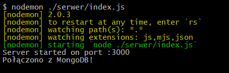

Aplikacja jest gotowa do użycia i dostępna pod adresem 'https://localhost:3000'

## About application
Po przejściu do adresu 'https://localhost:3000' zostanie wyświetlona strona startowa aplikacji.  

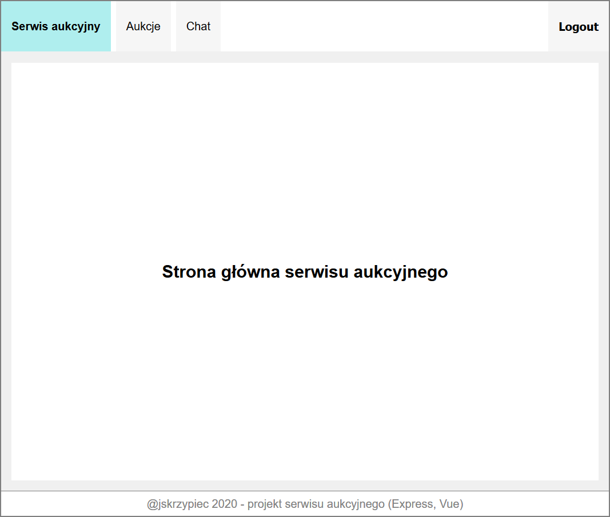   

Jako niezalogowany użytkownik mamy jedynie wgląd do dostępnych aukcji - nie możemy ich kupować, licytować ani też dodać swoich aukcji.   
  
Akcje mogą mieć 2 możliwe typy:  
- kup teraz
- licytacja  

Oba typy aukcji są ograniczone czasowo. Licytacja kończy się w momencie upłynięcia czasu licytacji - licytacje wygrywa najwyższa oferta. 
Aukcja typu kup teraz jest automatycznie kończona po tym, gdy ktoś kupi wystawiony na niej przedmiot.  

Niezalogowany użytkownik może założyć nowe konto.  
Udana rejestracja:  
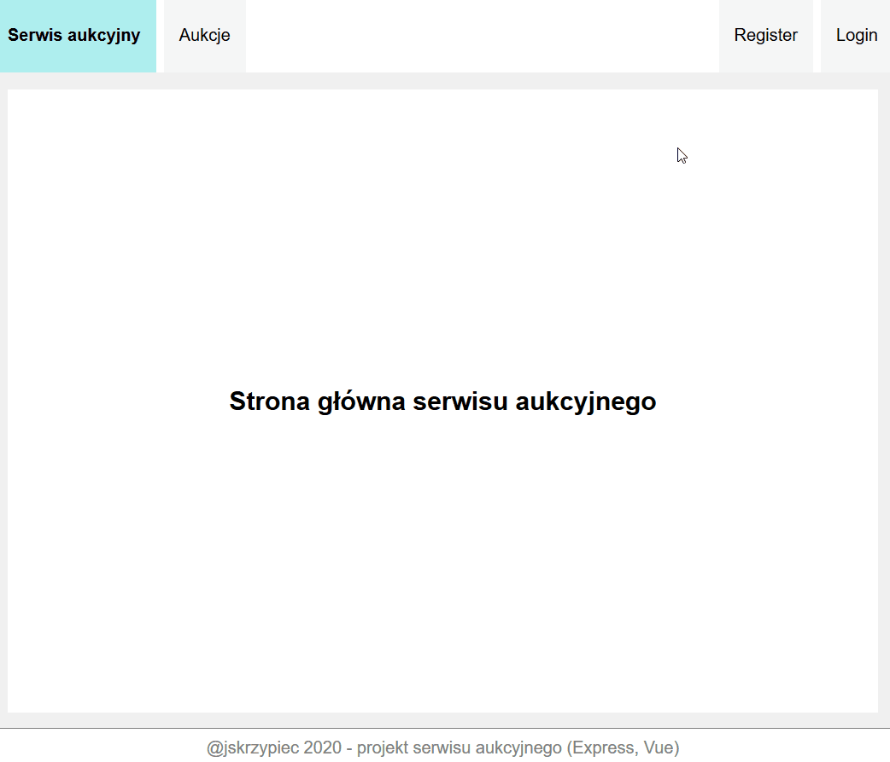  
Niepowodzenie, gdy hasło jest niepoprawne  
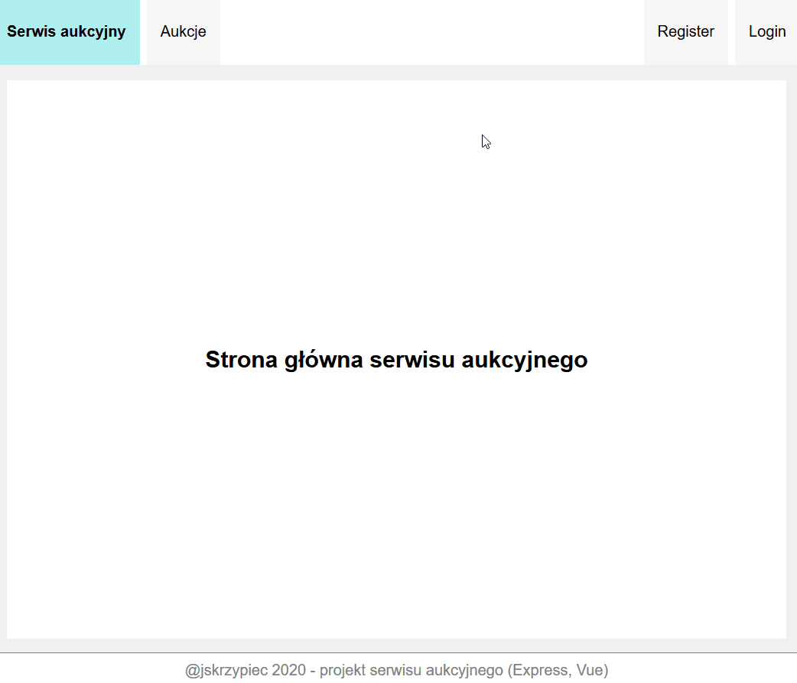  
Niepowodzenie, gdy nazwa użytkownika jest już zajęta:  
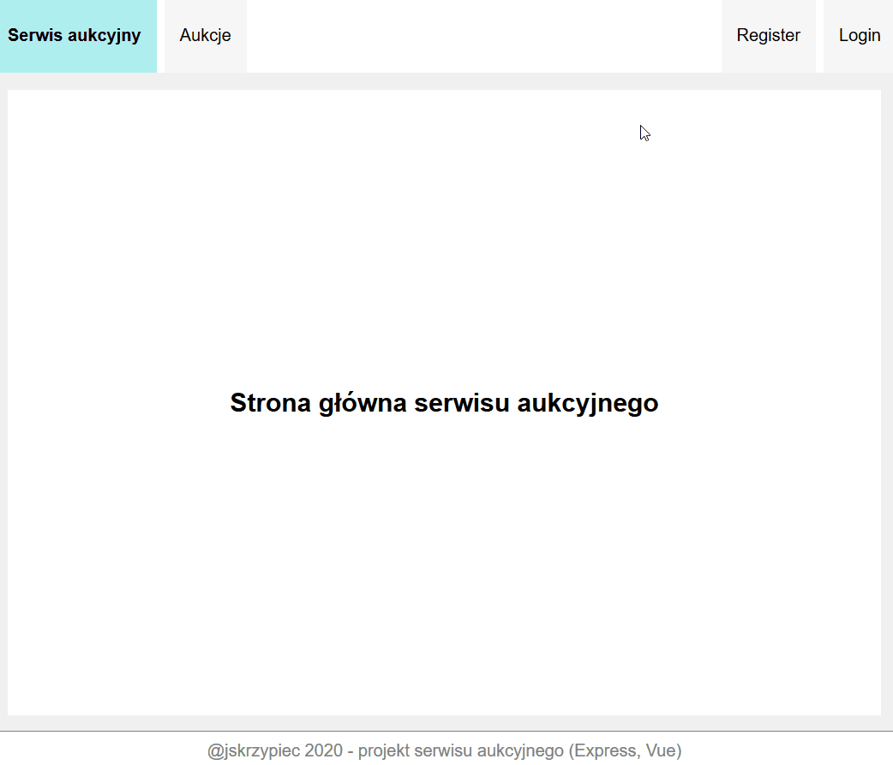  

Niezalogowany użytkownik może się zalogować  
Udane logowanie:  
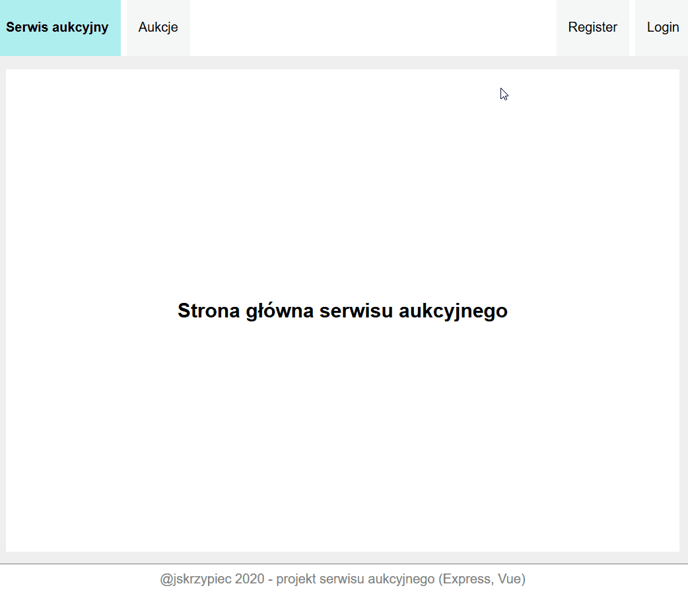  
Niepowodzenie, gdy wprowadzone dane będą niepoprawne - błędne hasło lub nazwa użytkownika, który nie istnieje:   
  

Po zalogowaniu użytkownik ma pełen dostęp do komponentu aukcji. W zakładce aukcje może wyświetlić  
- wszystkie aukcje
- moje kupione (kupione przedmioty oraz wygrane licytacje)
- moje licytowanie (licytacje, w których braliśmy udział)
- moje wystawione (przedmioty, które my wystawiliśmy na sprzedaż)

  

W zakładce 'wszystkie' dostępne są wszystkie aukcje. Stronicowanie aukcji umożliwia wybranie ilości aukcji na stronę.  
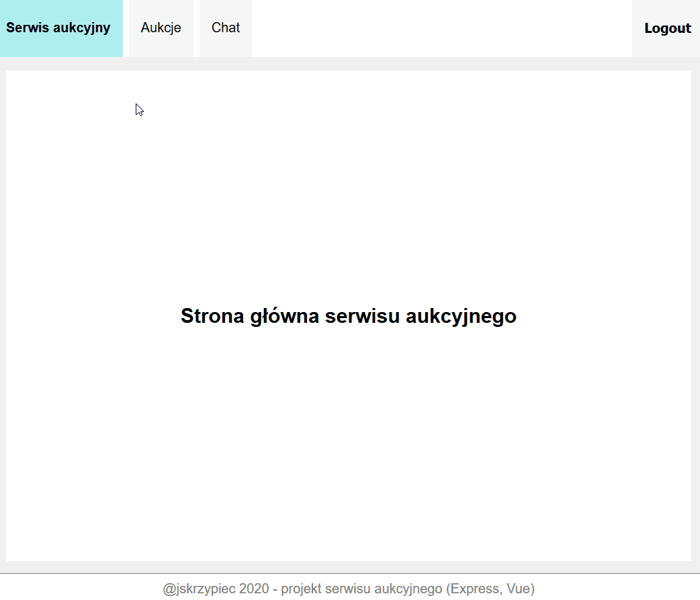  
W zakładce 'wszystkie' możemy wyszukiwać aukcje na podstawie nazwy przedmiotu lub użytkownika, który wystawia przedmiot.   
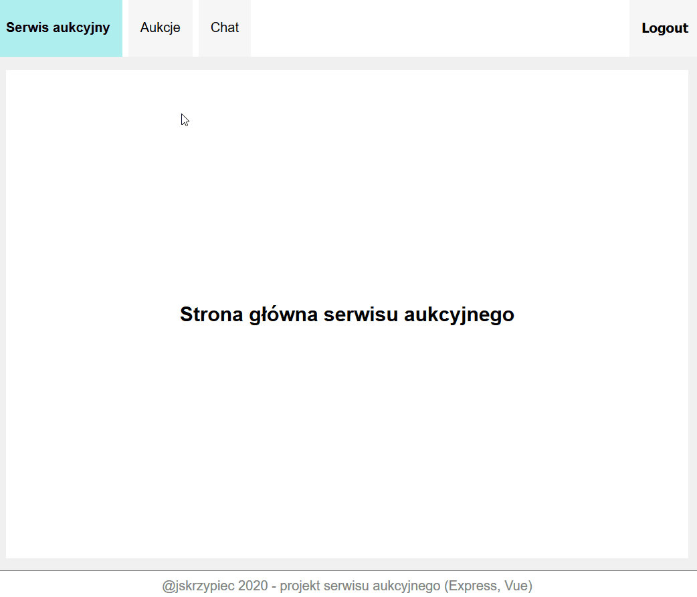  

Gdy weźmiemy udział w jakiejś licytacji - aukcja zostanie dodana do zakładki 'moje licytowane'. 
Gdy ktoś przebije naszą ofertę licytacji, zostaniemy o tym powiadomieni, a sama aukcja, którą przegrywamy, zostanie wyróżniona na liście 'moje licytowane'.  
  

Użytownik z poziomu komponentu 'aukcje' może dodać nową aukcję.  
Dodanie aukcji 'kup teraz':  
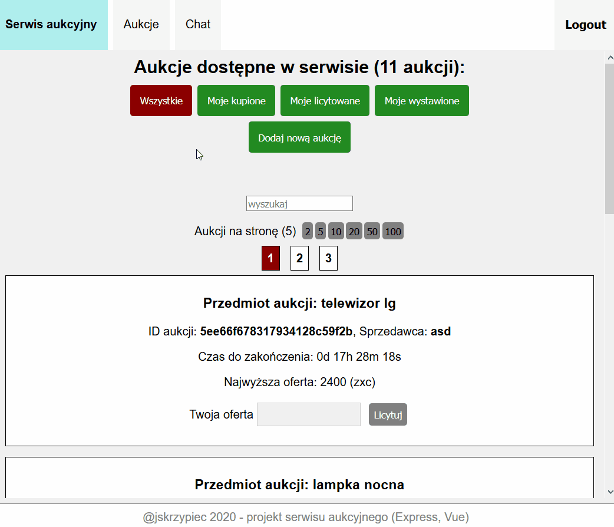  
Dodanie aukcji typu 'licytacja':  
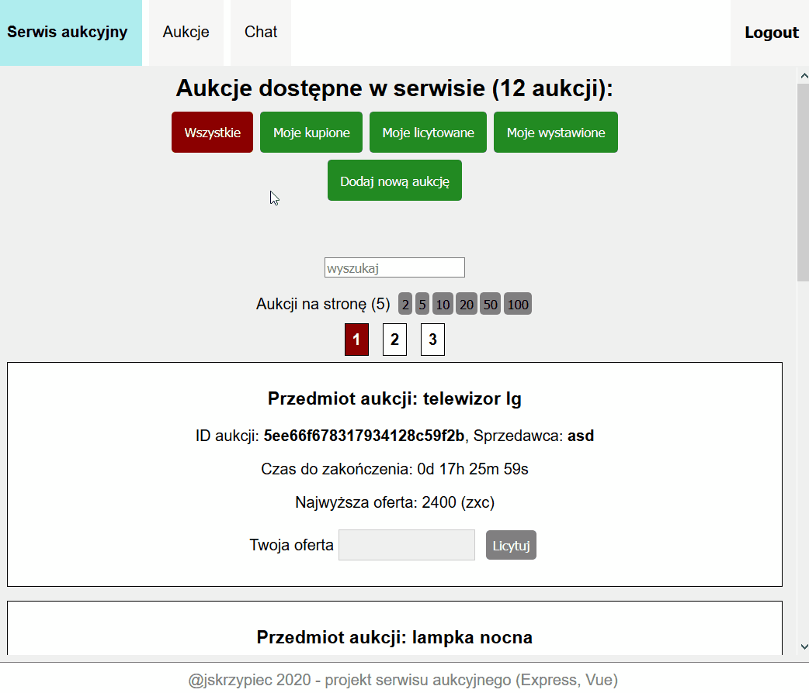  

Gdy chcemy dodać aukcję, zostanie nam wyświetlony widok podsumowania ze szczegółami aukcji. Wtedy możemy zatwierdzić dane i dodać aukcję lub wrócić do edycji szczegółów aukcji w celu zmiany danych. Przykład:  
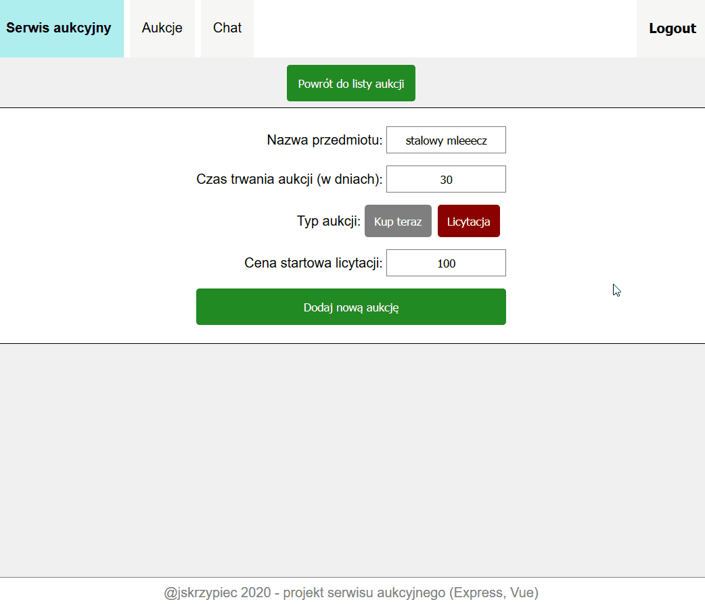  

Użytkownik ma również dostęp do chatu. W tym komponencie może wymieniać się wiadomościami z innymi użytkownikami. 
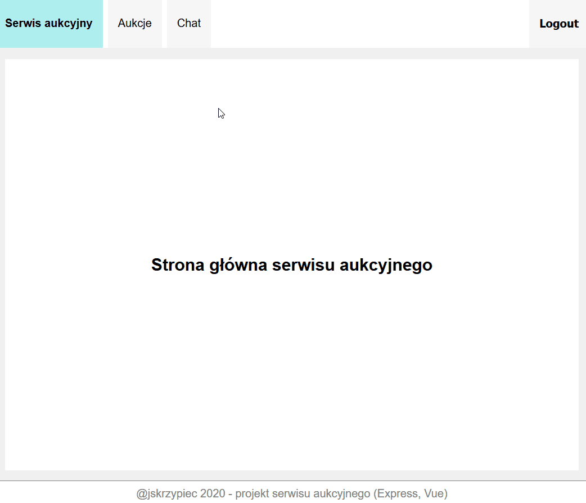  

Jeżeli jesteśmy zalogowani w trakcie otrzymania nowej wiadomości - zostaniemy o tym powiadomieni.  
  

Użytkownik może się wylogować.  
  

